# Goplow Architecture

Goplow is a real-time analytics event viewer and validator. It captures events from external systems, streams them to a web UI in real-time, and validates them against JSON schemas.

## Overview

Goplow consists of two main parts:

1. **Backend (Go)**: HTTP server that handles event ingestion, schema serving, and real-time event streaming via Server-Sent Events (SSE)
2. **Frontend (SolidJS)**: Reactive web UI that displays events in real-time, validates them against schemas, and provides visual feedback

---

## System Architecture

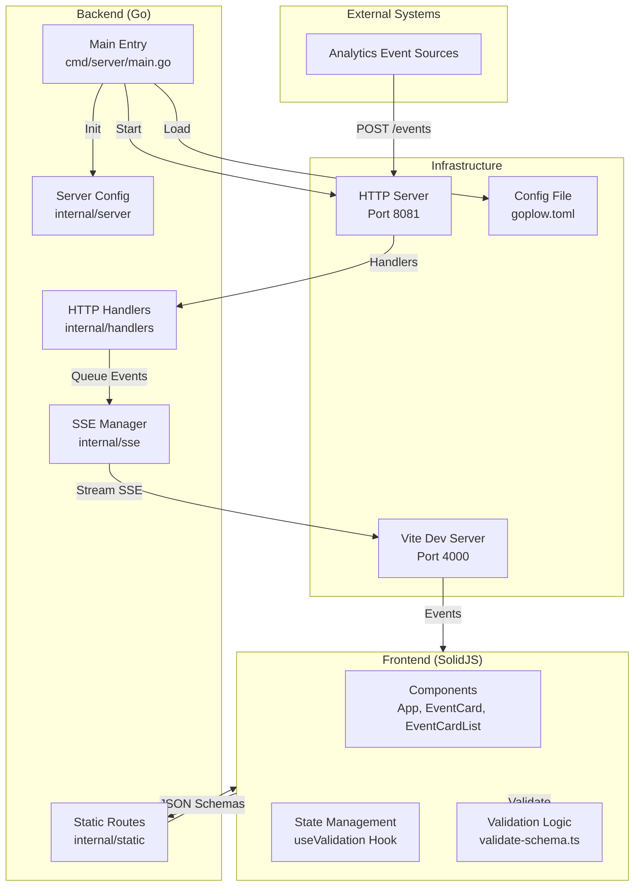

---

## Component Architecture

### Frontend Components

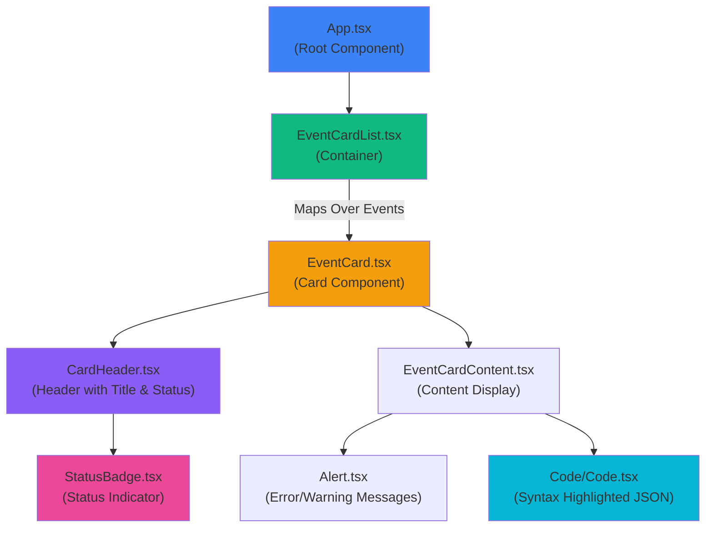

### Backend Handlers

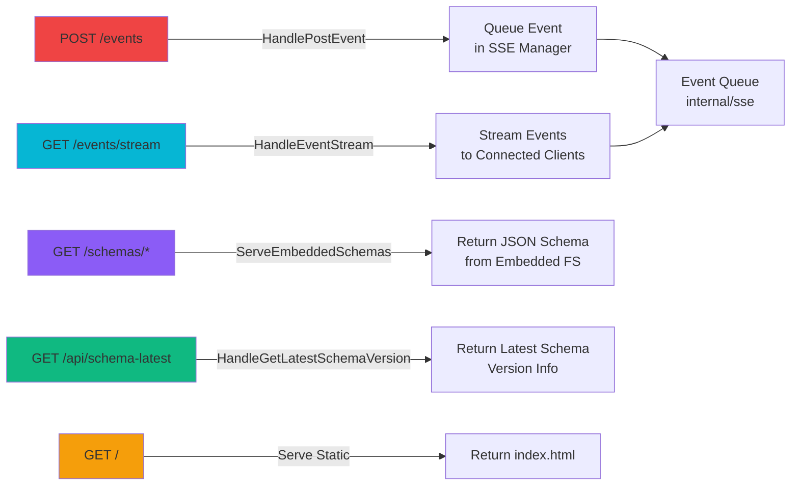

---

## Data Flow Diagrams

### Event Ingestion Flow

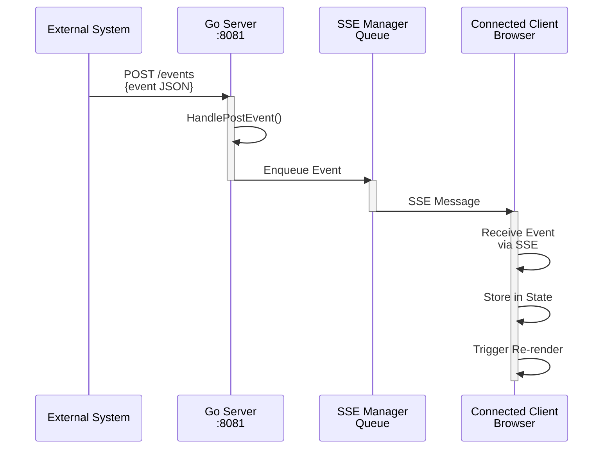

### Event Processing & Validation Flow

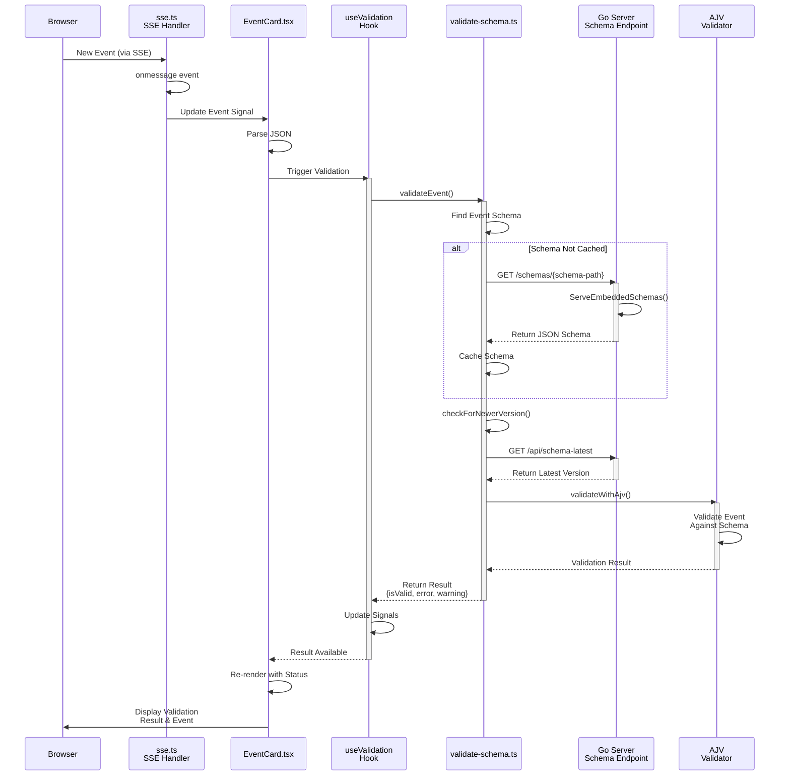

### Validation Result Flow

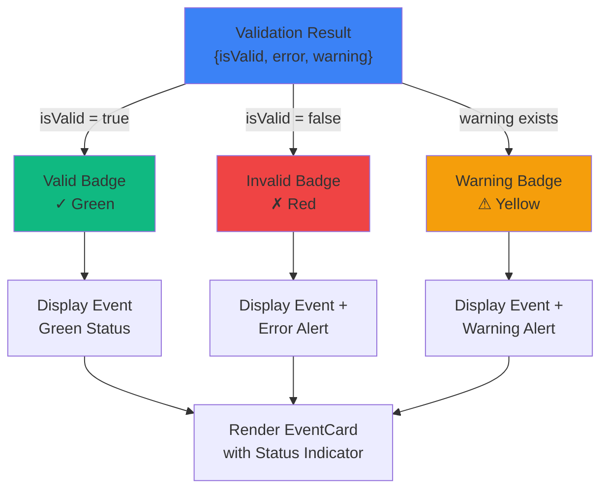

---

## Data Structures

### Event Structure

Events flow through the system with the following structure:

```typescript
interface Event {
  id: number; // Unique event ID
  schema: string; // Event schema URI
  data: Array<Record<string, unknown>>; // Event payload (usually single item)
  timestamp: string; // When event was created
  receivedAt: string; // When server received event
}
```

### Validation Result

```typescript
interface ValidationResult {
  isValid: boolean; // True if valid against schema
  error: string | null; // Error message if invalid
  warning: string | null; // Warning message (e.g., version mismatch)
}
```

### Configuration

```toml
# goplow.toml

[server]
port = 8081                          # Server port
host = "localhost"                   # Server host
max_messages = 1000                  # Max events to keep in memory
events_endpoint = "com.simplybusiness/events" # API endpoint path

[cors]
allowed_origins = "http://localhost:3000, http://localhost:4000"
```

---

## Configuration Loading

The application supports flexible configuration file loading:

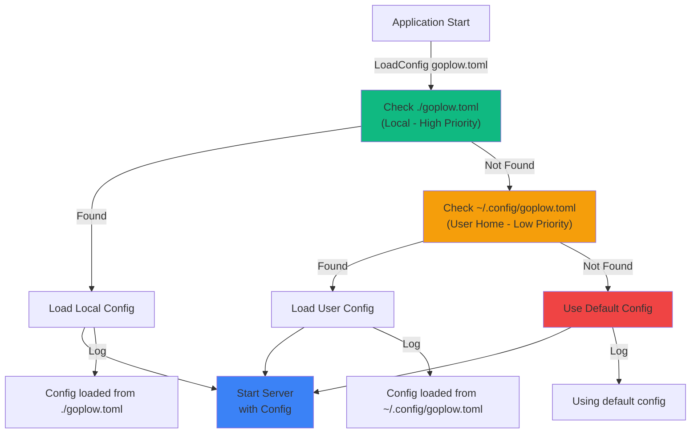

### Configuration Precedence

1. **Local `goplow.toml`** (highest priority) - in the same directory as the binary
2. **`~/.config/goplow.toml`** (fallback) - in user's home config directory
3. **Built-in Defaults** (lowest priority) - hardcoded defaults

---

## Schema Management

### Schema Discovery

Schemas are stored in the following directory structure:

```
schemas/
├── co.simplybusiness/
│   ├── command_envelope/
│   ├── command_response_envelope/
│   └── ...
├── com.simplybusiness/
│   ├── account_address_update_attempted/
│   ├── account_created/
│   └── ...
├── uk.co.simplybusiness/
│   └── ...
└── com.google.analytics/
    └── cookies/
```

### Schema Validation Process

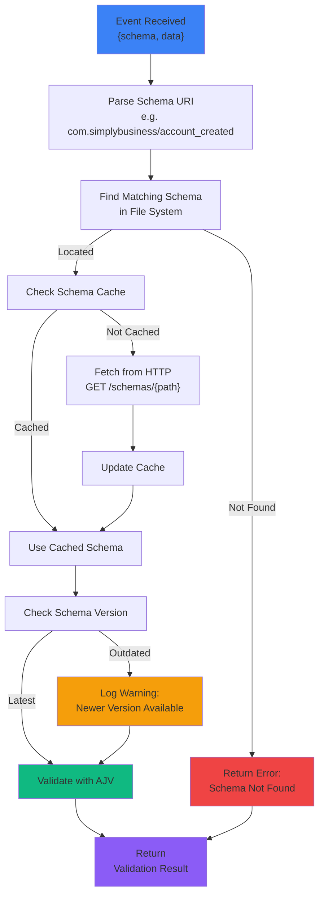

---

## Technology Stack

### Frontend

- **Framework**: SolidJS (reactive, lightweight)
- **Build Tool**: Vite
- **Validation**: AJV (JSON Schema validator)
- **JSON Display**: pretty-print-json (syntax highlighting)
- **Styling**: Tailwind CSS

### Backend

- **Language**: Go 1.20+
- **HTTP Routing**: Standard library `net/http`
- **Real-time Communication**: Server-Sent Events (SSE)
- **Configuration**: TOML (BurntSushi/toml)
- **Static Files**: Go embed (production builds)

### Development

- **Package Manager**: pnpm (frontend)
- **Task Runner**: Makefile (development scripts)
- **Dev Server**: Vite (frontend dev server)

---

## Development Workflow

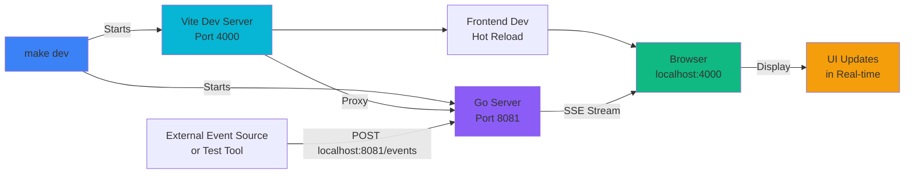

---

## Production Build

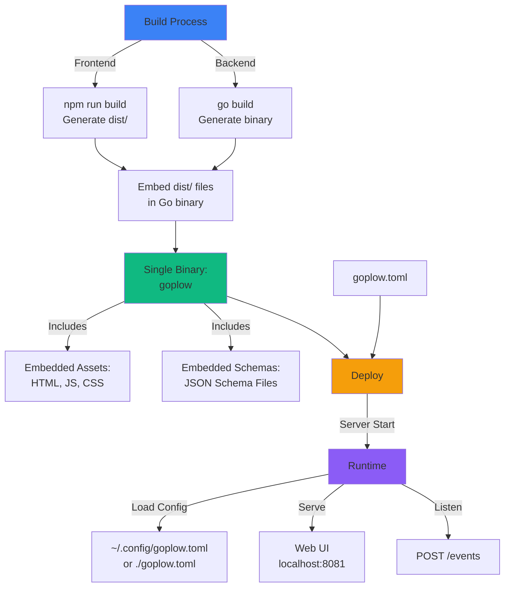

---

## Key Features

### Real-time Event Streaming

- Events are pushed to connected clients via SSE
- No polling required
- Automatic reconnection on disconnect
- Events queued while client is disconnected

### Event Validation

- Automatic validation against JSON schemas
- Version checking for schema updates
- Error and warning detection
- Visual status indicators (valid/invalid/warning)

### Flexible Configuration

- Multiple config file locations
- Local config takes precedence over user config
- Sensible defaults for quick start
- Easy CORS configuration

### Embedded Schemas

- Production builds include all schemas
- Development mode reads schemas from disk for hot reload
- Schema caching in frontend
- Latest version checking

---

## Error Handling

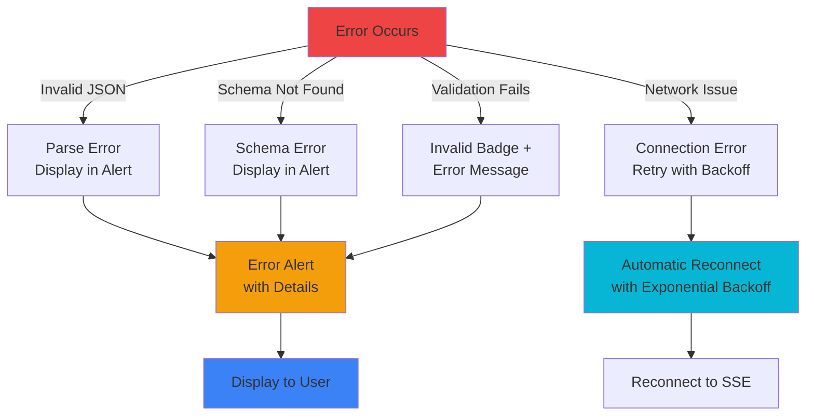

---

## Performance Considerations

### Frontend Optimization

- SolidJS ensures efficient reactive updates
- Schema caching prevents repeated HTTP requests
- Lazy schema loading on demand
- Pretty-print-json handles large payloads efficiently

### Backend Optimization

- SSE is efficient for one-way push communication
- Event queue with configurable max size
- Embedded schemas for fast serving
- File system caching for dev mode schemas

### Scaling

- Max message buffer prevents unbounded memory growth
- Multiple SSE clients can connect simultaneously
- Schemas served from embedded FS (O(1) lookup)
- CORS configured for production deployments

---

## Testing Strategy

The project includes test data in the `data/` directory:

- `form-question-answered.json`
- `help-opened.json`
- `state-answered.json`
- `trade-search.json`

These can be used to test the event ingestion and validation pipeline.

---

## Troubleshooting

### Common Issues

**Events not appearing:**

- Check if Go server is running (`localhost:8081`)
- Verify SSE connection in browser DevTools
- Check CORS configuration for event source

**Validation failing unexpectedly:**

- Check if schemas are loaded (`/schemas/` endpoint)
- Verify schema path in event matches file structure
- Check schema version in latest version endpoint

**Configuration not loading:**

- Verify `goplow.toml` exists in correct location
- Check file permissions
- Verify TOML syntax
